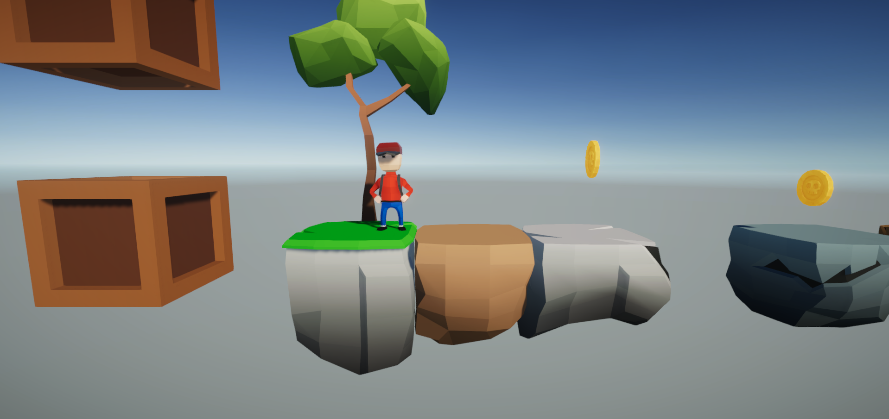
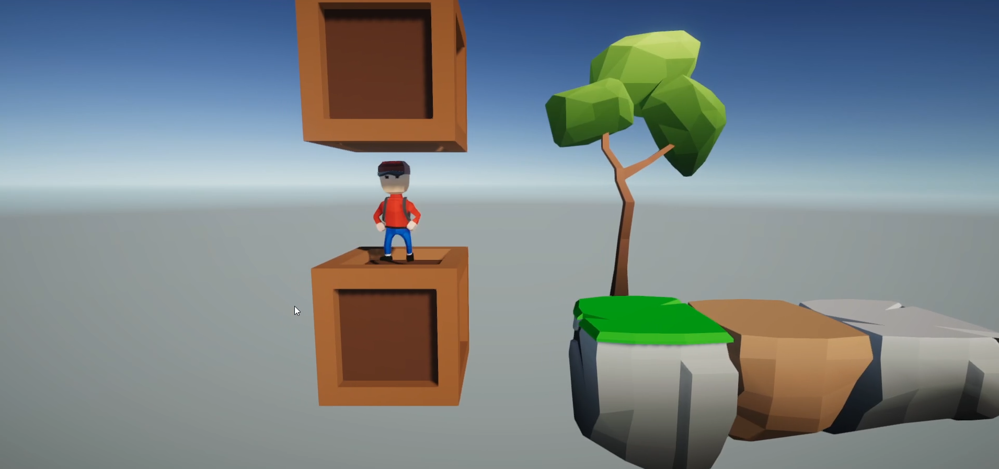
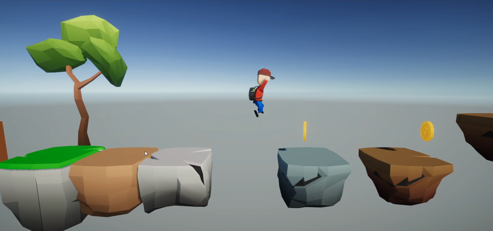
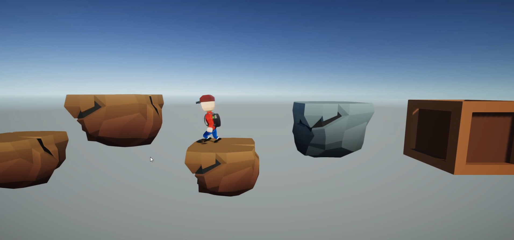
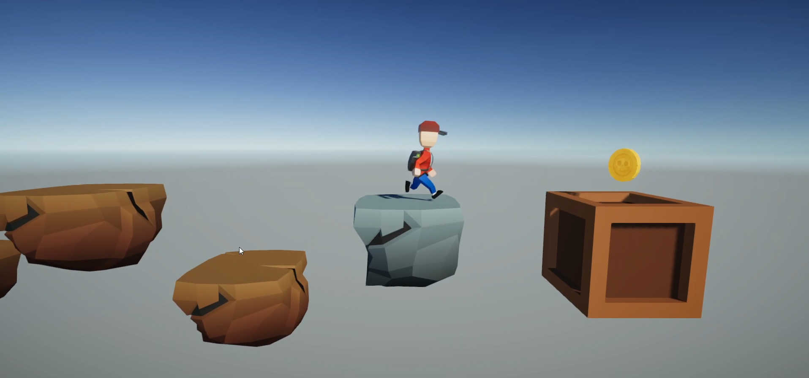
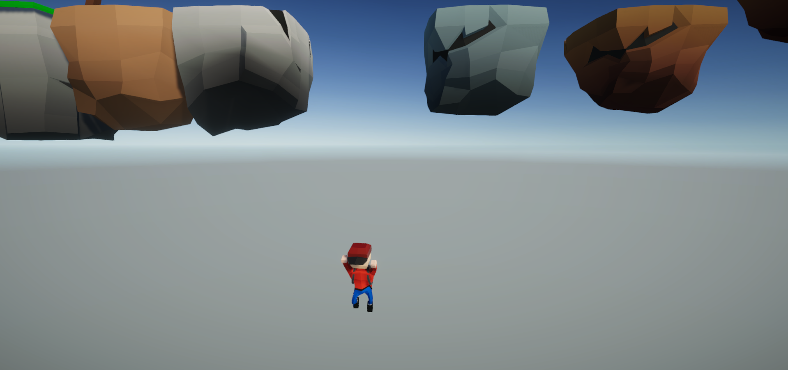

# BroX
 A simple platform game using low poly materials. (late 2020)
 
 This is a simple platform game which has low poly characters, obstacles, environment & enemy. All the low poly models made by me using blender. This project is still under development.

## Project description
Name: BroX  
Programming Language: C#  
Platform: PC game  
Project No: 25  
Year: late 2020 (still under development)

## Demo Video
<!--  -->

## Screen shot
  

  

  

## Authors

* **AbirHasan**

Check out my other works [@XAbirHasan](https://github.com/XAbirHasan)
